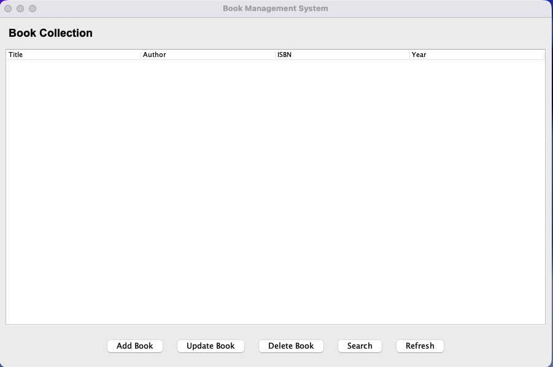

# Book Management System

A Java application for managing a book collection with both GUI and console interfaces. Features include insert, search, update, and delete operations with data persistence.

## Screenshot




## Features

- **Insert Books**: Add new books with title, author, ISBN, and publication year
- **Search Books**: Search by title, author, ISBN, or year
- **Update Books**: Modify existing book information
- **Delete Books**: Remove books from the collection
- **Data Persistence**: Books are automatically saved to file and loaded on startup
- **Input Validation**: Validates ISBN format, year ranges, and required fields

## Project Structure

```
├── Book.java                 # Book model class
├── BookManager.java          # Main business logic
├── BookSearcher.java         # Search functionality
├── BookFileManager.java      # File persistence
├── BookValidator.java        # Input validation
├── InvalidBookException.java # Custom exception
├── Main.java                 # Console interface
├── BookManagementGUI.java    # GUI interface (recommended)
└── README.md                 # This file
```

## Requirements

- Java 8 or higher
- No external dependencies required

## How to Run

### For End Users (Easiest)

1. **Download the latest release** from the [Releases](../../releases) page
2. **Double-click** `BookManagementSystem.jar` to launch the GUI
3. Make sure you have Java 17+ installed

### For Developers

**Build the distributable JAR:**

Windows:
```bash
build-jar.bat
```

macOS/Linux:
```bash
./build-jar.sh
```

**Run directly from source:**

GUI Version (Recommended):
```bash
javac *.java
java BookManagementGUI
```

Console Version:
```bash
javac *.java
java Main
```

## Usage

### GUI Version

The GUI provides an intuitive interface with:
- **Table View**: See all books in a sortable table
- **Add Book Button**: Opens a form to add new books
- **Update Book Button**: Select a book and click to edit it
- **Delete Book Button**: Select a book and click to remove it
- **Search Button**: Search by title, author, ISBN, or year
- **Refresh Button**: Reload all books from file

### Console Version

When you run the console application, you'll see a menu with the following options:

1. **Insert Book** - Add a new book to the collection
2. **Search Books** - Find books by various criteria
3. **Update Book** - Modify an existing book (search by ISBN)
4. **Delete Book** - Remove a book (search by ISBN)
5. **Display All Books** - Show all books in the collection
6. **Exit** - Save and quit the application

### Example: Adding a Book

```
--- Insert Book ---
Title: 1984
Author: George Orwell
ISBN: 978-0451524935
Year: 1949
```

### ISBN Format

- Accepts 10 or 13 digit ISBNs
- Hyphens and spaces are allowed (e.g., 978-0-451-52493-5)
- Must contain only digits (after removing hyphens/spaces)

### Year Validation

- Must be at least 1000
- Cannot be in the future

## Data Storage

Books are automatically saved to `books.dat` file in the same directory. The file is:
- Created automatically on first save
- Loaded automatically when the application starts
- Updated after each insert, update, or delete operation

## Error Handling

The application includes validation for:
- Empty or null values
- Invalid ISBN format
- Invalid year ranges
- Title/author length limits

## Future Enhancements

Possible improvements:
- GUI interface
- Database integration
- Export to CSV/JSON
- Advanced search filters
- Book categories/genres
- Multiple copies tracking

## License

Free to use and modify.
